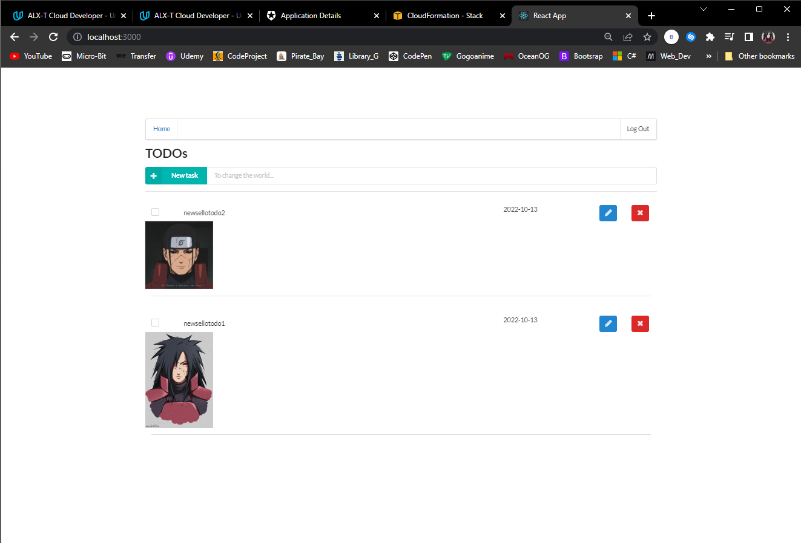

# AWS Serverless Task Manager



This is a Full-Stack serverless TODO application built with AWS Lambda, API Gateway, DynamoDB, and React. The application features secure authentication through Auth0 and demonstrates modern serverless architecture patterns. It enables users to manage personal tasks by creating, updating, deleting, and retrieving TODO items. The application ensures that each user can only access their own data and allows optional image attachments for each task.

## Data Model

Each TODO item contains the following fields:

* `todoId` (string): Unique identifier for the item
* `createdAt` (string): Timestamp of creation
* `name` (string): Description or title of the task
* `dueDate` (string): Task deadline
* `done` (boolean): Completion status
* `attachmentUrl` (string, optional): Link to an uploaded image

The application may also store a `userId` to associate tasks with specific users securely.

## Technologies Used

* **AWS Lambda** – Serverless compute platform
* **AWS API Gateway** – REST API interface
* **AWS DynamoDB** – NoSQL database for storing TODO items
* **AWS S3** – Storage service for attachments
* **Serverless Framework** – Infrastructure as Code for managing deployments
* **Node.js** – JavaScript runtime for backend logic
* **Auth0** – Authentication and authorization provider
* **React** – Frontend framework (if frontend is included)

## Usage

Once deployed, the application exposes RESTful endpoints for interacting with TODO items. Authenticated users can perform the following actions:

### Endpoints

| Method | Endpoint                     | Description                          |
| ------ | ---------------------------- | ------------------------------------ |
| GET    | `/todos`                     | Retrieve all TODO items for the user |
| POST   | `/todos`                     | Create a new TODO item               |
| PATCH  | `/todos/{todoId}`            | Update an existing TODO item         |
| DELETE | `/todos/{todoId}`            | Delete a TODO item                   |
| POST   | `/todos/{todoId}/attachment` | Upload an image attachment           |

All requests must include a valid JSON Web Token (JWT) from Auth0 for authorization. Attachments are securely uploaded via pre-signed S3 URLs.

## Documentation & Testing Resources

For detailed instructions on verifying this project functionality, refer to the following resources in the /docs directory:

- **README.md**: Showing the app actually working.
- **manual.pdf**: Step-by-step manual for setup and deployment.
- **postman**: Contains a Postman collection with example queries for testing API endpoints.

Review these files to ensure proper setup and to test all features of the Udagram Image Filtering Microservice.

## Project Structure

```
.
├── backend
│   ├── package.json
│   ├── package-lock.json
│   ├── serverless.yml
│   ├── src
│   │   ├── auth
│   │   │   ├── JwtPayload.ts
│   │   │   ├── Jwt.ts
│   │   │   └── utils.ts
│   │   ├── businessLogic
│   │   │   └── ToDo.ts
│   │   ├── dataLayer
│   │   │   └── ToDoAccess.ts
│   │   ├── lambda
│   │   │   ├── auth
│   │   │   │   └── auth0Authorizer.ts
│   │   │   ├── http
│   │   │   │   ├── createTodo.ts
│   │   │   │   ├── deleteTodo.ts
│   │   │   │   ├── generateUploadUrl.ts
│   │   │   │   ├── getTodos.ts
│   │   │   │   └── updateTodo.ts
│   │   │   └── utils.ts
│   │   ├── models
│   │   │   ├── TodoItem.ts
│   │   │   └── TodoUpdate.ts
│   │   ├── requests
│   │   │   ├── CreateTodoRequest.ts
│   │   │   └── UpdateTodoRequest.ts
│   │   └── utils
│   │       └── logger.ts
│   ├── tsconfig.json
│   └── webpack.config.js
├── client
│   ├── node_modules
│   ├── package.json
│   ├── package-lock.json
│   ├── public
│   │   ├── favicon.ico
│   │   ├── index.html
│   │   └── manifest.json
│   ├── README.md
│   ├── src
│   │   ├── api
│   │   │   └── todos-api.ts
│   │   ├── App.css
│   │   ├── App.tsx
│   │   ├── auth
│   │   │   └── Auth.js
│   │   ├── components
│   │   │   ├── Callback.tsx
│   │   │   ├── EditTodo.tsx
│   │   │   ├── LogIn.tsx
│   │   │   ├── NotFound.tsx
│   │   │   └── Todos.tsx
│   │   ├── config.ts
│   │   ├── index.css
│   │   ├── index.tsx
│   │   ├── logo.svg
│   │   ├── react-app-env.d.ts
│   │   ├── routing.tsx
│   │   ├── serviceWorker.ts
│   │   └── types
│   │       ├── CreateTodoRequest.ts
│   │       ├── Todo.ts
│   │       └── UpdateTodoRequest.ts
│   └── tsconfig.json
├── docs
│   ├── images
│   │   ├── screenshots/
│   │   └── serverless-framework.png
│   ├── manual.md
│   ├── postman
│   │   └── serverless.postman_collection.json
│   └── README.md
├── LICENSE
└── README.md
```

## Credits

- **Starter Code**: [Udacity Cloud Developer Course](https://github.com/udacity/cloud-developer/tree/master)
- This project was developed as part of the Udacity Cloud Engineering Nanodegree program.

## License

This project is licensed under the terms described in the [LICENSE](./LICENSE) file.

---
